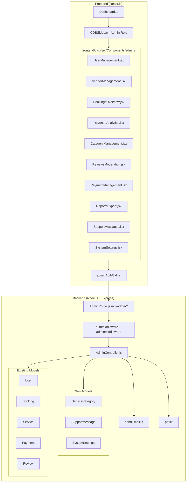

vf# Design Document: Admin Panel Enhancement

## Overview

Yeh design document home services platform ke admin panel enhancement feature ke liye hai. Existing admin panel mein sirf 5 sections hain (Profile, Manage Packages, Notifications, Invoices, Shortcuts). Is enhancement mein 10 nayi sections add ki jaayengi jo admin ko complete platform control deti hain.

**Tech Stack:**
- Backend: Node.js + Express.js + MongoDB (Mongoose)
- Frontend: React.js + Bootstrap 5 + CDBReact sidebar
- Auth: JWT tokens (localStorage), existing `authmiddleware.js` + `adminmiddleware.js`
- Email: Nodemailer via existing `sendEmail.js` utility
- PDF: `pdfkit` (already installed, used in PaymentController)

**Design Principles:**
- Existing patterns ko follow karna — `AdminPackageManager.jsx` style, `packageAuthCall.js` API call pattern
- Sab admin routes `authmiddleware` + `adminmiddleware` se protect honge
- Frontend mein `Services/operation/adminAuthCall.js` ek central file hogi
- Sab endpoints `/api/admin/*` prefix ke under honge
- 3 naaye MongoDB models banenge: `ServiceCategory`, `SupportMessage`, `SystemSettings`

---

## Architecture



**Request Flow:**
1. Admin frontend component → `adminAuthCall.js` → `Authorization: Bearer <token>` header
2. Express router `/api/admin/*` → `authmiddleware` (JWT verify, attach `req.user`) → `adminmiddleware` (role check) → controller function
3. Controller → MongoDB query → JSON response
4. Frontend → state update → re-render (no full page reload)

---

## Components and Interfaces

### Backend: New Route File

**`backend/routers/AdminRoute.js`** — single file for all 10 admin sections:

```
GET    /api/admin/users                    — paginated user list
PATCH  /api/admin/users/:id/block          — block/unblock user
PATCH  /api/admin/users/:id/role           — change user role
DELETE /api/admin/users/:id               — delete user

GET    /api/admin/vendors                  — paginated vendor list
PATCH  /api/admin/vendors/:id/verify       — verify vendor
PATCH  /api/admin/vendors/:id/suspend      — suspend vendor
PATCH  /api/admin/services/:id/approval   — approve/reject service

GET    /api/admin/bookings                 — paginated bookings (filter: status, dateFrom, dateTo)
GET    /api/admin/bookings/:id             — booking detail

GET    /api/admin/analytics                — summary cards + monthly revenue + top services/vendors

GET    /api/admin/categories               — list all categories
POST   /api/admin/categories               — create category
PUT    /api/admin/categories/:id           — rename category (cascades to Services)
DELETE /api/admin/categories/:id           — delete category (blocked if services exist)

GET    /api/admin/reviews                  — paginated reviews (filter: rating)
DELETE /api/admin/reviews/:id              — delete review

GET    /api/admin/payments                 — paginated payments (filter: status)
PATCH  /api/admin/payments/:id/refund      — mark as refunded

GET    /api/admin/export/bookings          — CSV download
GET    /api/admin/export/payments          — CSV download
GET    /api/admin/export/users             — CSV download

GET    /api/admin/support                  — paginated support messages
POST   /api/admin/support                  — user submits support message (public, no admin middleware)
PATCH  /api/admin/support/:id/reply        — admin replies (sends email, marks replied)

GET    /api/admin/settings                 — get system settings
PUT    /api/admin/settings                 — update system settings
```

### Backend: AdminController.js

Single controller file with named exports for each handler. Grouped by section:

```javascript
// User Management
getUserList(req, res)       // GET /admin/users — query, pagination, populate profileImage
blockUnblockUser(req, res)  // PATCH /admin/users/:id/block — toggle isBlocked
changeUserRole(req, res)    // PATCH /admin/users/:id/role — validate enum
deleteUser(req, res)        // DELETE /admin/users/:id

// Vendor Management
getVendorList(req, res)     // GET /admin/vendors — role=service filter
verifyVendor(req, res)      // PATCH /admin/vendors/:id/verify
suspendVendor(req, res)     // PATCH /admin/vendors/:id/suspend
updateServiceApproval(req, res) // PATCH /admin/services/:id/approval

// Bookings
getAllBookings(req, res)     // GET /admin/bookings — populate userId, serviceId
getBookingDetail(req, res)  // GET /admin/bookings/:id

// Analytics
getAnalytics(req, res)      // GET /admin/analytics — aggregation pipelines

// Categories
getCategories(req, res)
createCategory(req, res)
updateCategory(req, res)    // cascades to Service.updateMany
deleteCategory(req, res)    // blocked if services exist

// Reviews
getReviews(req, res)
deleteReview(req, res)

// Payments
getPayments(req, res)
markRefunded(req, res)

// Export
exportBookingsCSV(req, res)
exportPaymentsCSV(req, res)
exportUsersCSV(req, res)

// Support
getSupportMessages(req, res)
submitSupportMessage(req, res)  // public endpoint
replyToSupportMessage(req, res) // uses sendEmail utility

// Settings
getSettings(req, res)
updateSettings(req, res)
```

### Frontend: API Call Layer

**`frontend/clsp/src/Services/operation/adminAuthCall.js`** — follows exact same pattern as `packageAuthCall.js`:

```javascript
import apiConnector from "../apiconfig.js";
import { endpoint } from "../api.js";

// All admin functions accept token as last parameter
// Example:
export const getUsers = async (params, token) => { ... }
export const blockUser = async (userId, isBlocked, token) => { ... }
// ... etc for all 30+ endpoints
```

New endpoints added to `api.js` under `// Admin Panel` section:

```javascript
ADMIN_USERS:           API_BASE_URL + "admin/users",
ADMIN_USER_BLOCK:      API_BASE_URL + "admin/users/:id/block",
ADMIN_USER_ROLE:       API_BASE_URL + "admin/users/:id/role",
ADMIN_USER_DELETE:     API_BASE_URL + "admin/users/:id",
// ... all 30+ admin endpoints
```

### Frontend: Admin Components

Each component in `frontend/clsp/src/Components/admin/` follows `AdminPackageManager.jsx` pattern:
- Functional component with hooks (`useState`, `useEffect`)
- `token = localStorage.getItem("token")` at top
- `react-toastify` for all notifications
- Bootstrap 5 tables, modals, cards
- Loading spinner while fetching
- Error handling with toast

**Component list:**
| File | Section | Key UI Elements |
|------|---------|-----------------|
| `UserManagement.jsx` | User Management | Table + search input + block/unblock/role dropdown/delete buttons |
| `VendorManagement.jsx` | Vendor Management | Table + verify/suspend/approve/reject buttons |
| `BookingsOverview.jsx` | All Bookings | Table + status filter + date range picker + detail modal |
| `RevenueAnalytics.jsx` | Revenue & Analytics | Summary cards + bar chart (Chart.js) + top 5 lists |
| `CategoryManagement.jsx` | Service Categories | List + add form + edit inline + delete with confirmation |
| `ReviewsModeration.jsx` | Reviews Moderation | Table + rating filter + full review modal + delete |
| `PaymentManagement.jsx` | Payment Management | Table + status filter + summary cards + refund + PDF download |
| `ReportsExport.jsx` | Reports & Export | Date range picker + 3 export buttons (CSV) + PDF option |
| `SupportMessages.jsx` | Support Messages | Inbox list + detail view + reply form |
| `SystemSettings.jsx` | System Settings | Form with all settings fields + maintenance mode warning |

### Dashboard.js Changes

`adminRenderSection()` switch extended with 10 new cases. CDBSidebar admin section extended with 10 new menu items. Support Messages item gets a badge with unread count.

---

## Data Models

### Existing Models — Field Additions

**User model** — 2 new fields needed:

```javascript
isBlocked: { type: Boolean, default: false },
isVerified: { type: Boolean, default: false },  // for vendors
```

**Service model** — 1 new field needed:

```javascript
approvalStatus: {
  type: String,
  enum: ["pending", "approved", "rejected"],
  default: "pending"
},
```

### New Model 1: ServiceCategory

**`backend/models/ServiceCategory.js`**

```javascript
const serviceCategorySchema = new mongoose.Schema({
  name: {
    type: String,
    required: true,
    unique: true,
    trim: true,
    maxlength: 100
  },
  createdBy: {
    type: mongoose.Schema.Types.ObjectId,
    ref: "User",
    required: true
  },
  isActive: {
    type: Boolean,
    default: true
  }
}, { timestamps: true });

module.exports = mongoose.model("ServiceCategory", serviceCategorySchema);
```

**Design Decision:** `ServiceCategory` ek separate collection hai (string field nahi). Isse admin categories ko centrally manage kar sakta hai. Rename operation `Service.updateMany({ category: oldName }, { category: newName })` se cascade hoga.

### New Model 2: SupportMessage

**`backend/models/SupportMessage.js`**

```javascript
const supportMessageSchema = new mongoose.Schema({
  senderName: { type: String, required: true, trim: true },
  senderEmail: { type: String, required: true, trim: true },
  subject: { type: String, required: true, trim: true, maxlength: 200 },
  message: { type: String, required: true, trim: true, maxlength: 2000 },
  userId: {
    type: mongoose.Schema.Types.ObjectId,
    ref: "User",
    default: null  // null if submitted by unauthenticated user
  },
  status: {
    type: String,
    enum: ["pending", "replied"],
    default: "pending"
  },
  replyText: { type: String, default: "" },
  repliedAt: { type: Date, default: null },
  repliedBy: {
    type: mongoose.Schema.Types.ObjectId,
    ref: "User",
    default: null
  }
}, { timestamps: true });

module.exports = mongoose.model("SupportMessage", supportMessageSchema);
```

### New Model 3: SystemSettings

**`backend/models/SystemSettings.js`**

```javascript
const systemSettingsSchema = new mongoose.Schema({
  commissionRate: {
    type: Number,
    min: 0,
    max: 100,
    default: 10
  },
  otpExpiryMinutes: {
    type: Number,
    default: 10,
    min: 1,
    max: 60
  },
  platformName: {
    type: String,
    default: "CLSP Services",
    trim: true
  },
  supportEmail: {
    type: String,
    default: "",
    trim: true
  },
  maintenanceMode: {
    type: Boolean,
    default: false
  },
  updatedBy: {
    type: mongoose.Schema.Types.ObjectId,
    ref: "User",
    default: null
  }
}, { timestamps: true });

// Singleton pattern — only one settings document
module.exports = mongoose.model("SystemSettings", systemSettingsSchema);
```

**Design Decision:** SystemSettings singleton pattern — `findOneAndUpdate({}, data, { upsert: true, new: true })` se ek hi document maintain hoga.

### Analytics Aggregation Pipelines

**Monthly Revenue (Requirement 4.2):**
```javascript
Payment.aggregate([
  { $match: { status: "success", createdAt: { $gte: yearStart } } },
  { $group: {
    _id: { month: { $month: "$createdAt" } },
    total: { $sum: "$amount" }
  }},
  { $sort: { "_id.month": 1 } }
])
```

**Top 5 Services by Booking Count (Requirement 4.3):**
```javascript
Booking.aggregate([
  { $match: { status: "Confirmed" } },
  { $group: { _id: "$serviceId", count: { $sum: 1 } } },
  { $sort: { count: -1 } },
  { $limit: 5 },
  { $lookup: { from: "services", localField: "_id", foreignField: "_id", as: "service" } }
])
```

**Top 5 Vendors by Revenue (Requirement 4.4):**
```javascript
Payment.aggregate([
  { $match: { status: "success" } },
  { $lookup: { from: "histories", localField: "orderId", foreignField: "orderId", as: "history" } },
  // group by vendor, sum amounts
])
```

---

## Correctness Properties

*A property is a characteristic or behavior that should hold true across all valid executions of a system — essentially, a formal statement about what the system should do. Properties serve as the bridge between human-readable specifications and machine-verifiable correctness guarantees.*

### Property 1: User Search Filter Correctness

*For any* list of users and any non-empty search query string, the search filter function SHALL return only users whose `username` or `email` contains the query string (case-insensitive), and SHALL NOT include any user that does not match.

**Validates: Requirements 1.2**

---

### Property 2: Block/Unblock Round-Trip

*For any* user, blocking then immediately unblocking that user SHALL restore the user's `isBlocked` field to `false` — the same value it had before the block operation.

**Validates: Requirements 1.3, 1.4**

---

### Property 3: Role Update Persistence

*For any* user and any valid role value from the enum `["admin", "user", "service"]`, after a role update operation, querying that user's `role` field SHALL return the new role value.

**Validates: Requirements 1.5**

---

### Property 4: Vendor List Role Filter

*For any* collection of users with mixed roles, the vendor list endpoint SHALL return only users whose `role` equals `"service"`, and SHALL NOT include any user with role `"admin"` or `"user"`.

**Validates: Requirements 2.1**

---

### Property 5: Service Approval Status Mutation

*For any* service and any approval action (`"approved"` or `"rejected"`), after the approval action is applied, querying that service's `approvalStatus` field SHALL return the exact value that was set by the action.

**Validates: Requirements 2.2, 2.3**

---

### Property 6: Booking Status Filter Correctness

*For any* collection of bookings with mixed statuses and any status filter value (`"Pending"`, `"Confirmed"`, `"Cancelled"`), the filtered result SHALL contain only bookings whose `status` matches the filter, and SHALL NOT contain any booking with a different status.

**Validates: Requirements 3.2**

---

### Property 7: Booking Date Range Filter Correctness

*For any* collection of bookings with varying `createdAt` dates and any valid date range `[dateFrom, dateTo]`, the filtered result SHALL contain only bookings where `dateFrom <= createdAt <= dateTo`, and SHALL NOT contain any booking outside that range.

**Validates: Requirements 3.3**

---

### Property 8: Revenue Aggregation Correctness

*For any* collection of payment records with mixed statuses, the total revenue calculation SHALL equal the exact arithmetic sum of `amount` fields for all payments where `status === "success"`, and SHALL NOT include amounts from payments with any other status.

**Validates: Requirements 4.1, 4.6**

---

### Property 9: Monthly Revenue Grouping Correctness

*For any* collection of successful payment records spanning multiple calendar months, the monthly revenue grouping function SHALL produce exactly one entry per distinct month, and the `total` for each month SHALL equal the sum of `amount` for all payments in that month.

**Validates: Requirements 4.2**

---

### Property 10: Top-N Ranking Correctness

*For any* collection of bookings or payments, the top-5 ranking function SHALL return at most 5 results, and the results SHALL be ordered in descending order by their aggregate value (count or revenue), such that no unranked item has a higher aggregate value than any ranked item.

**Validates: Requirements 4.3, 4.4**

---

### Property 11: Category Distinctness

*For any* collection of `Service` documents with repeated `category` values, the category list function SHALL return a list with no duplicate category names — each category name SHALL appear exactly once.

**Validates: Requirements 5.1**

---

### Property 12: Category Rename Cascade

*For any* category name `oldName` and any new name `newName`, after a rename operation, every `Service` document that previously had `category === oldName` SHALL have `category === newName`, and no `Service` document SHALL still have `category === oldName`.

**Validates: Requirements 5.3**

---

### Property 13: Category Deletion Guard

*For any* category that has one or more associated `Service` documents (i.e., `Service.countDocuments({ category: name }) > 0`), a delete request for that category SHALL be rejected with an error response, and the category SHALL remain in the database unchanged.

**Validates: Requirements 5.5**

---

### Property 14: Review Rating Filter Correctness

*For any* collection of reviews with ratings 1–5 and any rating filter value `r` in `[1, 2, 3, 4, 5]`, the filtered result SHALL contain only reviews where `rating === r`, and SHALL NOT contain any review with a different rating.

**Validates: Requirements 6.2**

---

### Property 15: Payment Status Filter and Summary Correctness

*For any* collection of payment records with mixed statuses, the payment summary function SHALL produce, for each distinct status value, a count equal to the number of payments with that status and a total amount equal to the sum of `amount` for payments with that status.

**Validates: Requirements 7.2, 7.5**

---

### Property 16: Refund Status Mutation

*For any* payment record with `status === "success"`, after the mark-as-refunded operation, querying that payment's `status` field SHALL return `"refunded"`.

**Validates: Requirements 7.3**

---

### Property 17: CSV Export Field Completeness

*For any* collection of records (bookings, payments, or users), the CSV export function SHALL produce a CSV string where every row contains all required columns for that record type, and the value in each column SHALL match the corresponding field of the source record.

**Validates: Requirements 8.1, 8.2, 8.3**

---

### Property 18: Export Date Range Filter Correctness

*For any* collection of records with varying `createdAt` dates and any valid date range `[dateFrom, dateTo]`, the exported CSV SHALL contain only records where `dateFrom <= createdAt <= dateTo`, and SHALL NOT contain any record outside that range.

**Validates: Requirements 8.4**

---

### Property 19: Support Message Reply Status Transition

*For any* support message with `status === "pending"`, after a successful reply operation, querying that message's `status` field SHALL return `"replied"`, and `replyText` SHALL contain the reply content.

**Validates: Requirements 9.3**

---

### Property 20: Unread Badge Count Accuracy

*For any* collection of support messages, the unread badge count SHALL equal the exact count of messages where `status === "pending"`, and SHALL NOT include messages where `status === "replied"`.

**Validates: Requirements 9.4, 11.4**

---

### Property 21: Commission Rate Validation

*For any* numeric input value `v`, the commission rate validator SHALL accept the value (return valid) if and only if `0 <= v <= 100`. For any value outside this range, the validator SHALL reject it with an error.

**Validates: Requirements 10.3**

---

### Property 22: Settings Round-Trip Persistence

*For any* valid `SystemSettings` object, saving the settings and then loading them SHALL return an object with field values equal to the saved values for all fields: `commissionRate`, `otpExpiryMinutes`, `platformName`, `supportEmail`, and `maintenanceMode`.

**Validates: Requirements 10.2, 10.4**

---

### Property 23: Sidebar Navigation State Mapping

*For any* sidebar menu item key, clicking that item SHALL set `activeSection` in both React state and `localStorage` to the exact key string associated with that menu item, such that reading `localStorage.getItem("activeSection")` returns the same key.

**Validates: Requirements 11.2, 11.3**

---

## Error Handling

### Backend Error Responses

All admin controller functions follow a consistent error response format:

```javascript
// Success
res.status(200).json({ success: true, data: ..., message: "..." })

// Validation error
res.status(400).json({ success: false, message: "Validation error description" })

// Auth error (handled by middleware)
res.status(401).json({ message: "Access Denied, No Token Provided" })
res.status(403).json({ message: "Access Denied, Admins Only" })

// Not found
res.status(404).json({ success: false, message: "Resource not found" })

// Server error
res.status(500).json({ success: false, message: "Server Error", error: err.message })
```

### Specific Error Cases

| Scenario | HTTP Status | Message |
|----------|-------------|---------|
| Delete category with active services | 400 | "Cannot delete: X services use this category. Reassign them first." |
| Block self (admin blocking own account) | 400 | "Admin cannot block their own account" |
| Invalid commission rate (outside 0-100) | 400 | "Commission rate must be between 0 and 100" |
| Mark non-success payment as refunded | 400 | "Only payments with status 'success' can be marked as refunded" |
| Email send failure on support reply | 500 | "Email delivery failed. Message status remains pending." |
| Export with invalid date range | 400 | "dateFrom must be before dateTo" |

### Frontend Error Handling

Every `adminAuthCall.js` function wraps the axios call in try/catch and throws `error.response?.data || "Fallback error message"`. Each component catches this in its async handler and calls `toast.error(err?.message || err)`.

---

## Testing Strategy

### Unit Tests (Backend)

Framework: **Jest** (already in Node.js ecosystem, standard choice)

Focus areas:
- `AdminController.js` pure logic functions (CSV generation, analytics aggregation helpers, commission rate validator)
- Model validation (ServiceCategory uniqueness, SystemSettings min/max constraints)
- Middleware chain: verify `authmiddleware` + `adminmiddleware` combination rejects non-admin requests

Example unit tests:
- `generateCSV(bookings)` returns correct headers and row count
- `validateCommissionRate(105)` returns false, `validateCommissionRate(15)` returns true
- `adminmiddleware` with `req.user.role = "user"` returns 403

### Property-Based Tests (Backend)

Framework: **fast-check** (TypeScript/JavaScript PBT library, works with Jest)

Install: `npm install --save-dev fast-check`

Configuration: minimum **100 iterations** per property test.

Tag format: `// Feature: admin-panel-enhancement, Property N: <property_text>`

Each correctness property maps to one property-based test:

| Property | Test Description | Generators |
|----------|-----------------|------------|
| P1: User Search Filter | `fc.array(fc.record({username: fc.string(), email: fc.emailAddress()}))` + `fc.string()` | User array + query string |
| P2: Block/Unblock Round-Trip | `fc.record({_id: fc.uuid(), isBlocked: fc.boolean()})` | User object |
| P3: Role Update Persistence | `fc.constantFrom("admin","user","service")` | Valid role enum values |
| P4: Vendor List Role Filter | `fc.array(fc.record({role: fc.constantFrom("admin","user","service")}))` | Mixed-role user array |
| P5: Service Approval Status | `fc.constantFrom("approved","rejected")` | Approval action values |
| P6: Booking Status Filter | `fc.array(fc.record({status: fc.constantFrom("Pending","Confirmed","Cancelled")}))` | Booking array + status filter |
| P7: Booking Date Range Filter | `fc.record({createdAt: fc.date()})` + date range | Booking with date + range |
| P8: Revenue Aggregation | `fc.array(fc.record({amount: fc.nat(), status: fc.constantFrom(...)}))` | Payment array |
| P9: Monthly Revenue Grouping | `fc.array(fc.record({amount: fc.nat(), createdAt: fc.date(), status: fc.constant("success")}))` | Success payments |
| P10: Top-N Ranking | `fc.array(fc.record({serviceId: fc.uuid(), count: fc.nat()}), {minLength: 1})` | Booking counts |
| P11: Category Distinctness | `fc.array(fc.constantFrom("Plumbing","Carpentry","Cleaning","Electrical"))` | Category strings with repeats |
| P12: Category Rename Cascade | `fc.string()` + `fc.string()` | Old name + new name |
| P13: Category Deletion Guard | `fc.nat({min: 1})` | Service count > 0 |
| P14: Review Rating Filter | `fc.array(fc.record({rating: fc.integer({min:1,max:5})}))` + `fc.integer({min:1,max:5})` | Reviews + rating filter |
| P15: Payment Summary | `fc.array(fc.record({status: fc.constantFrom(...), amount: fc.nat()}))` | Payment array |
| P16: Refund Status Mutation | `fc.record({_id: fc.uuid(), status: fc.constant("success")})` | Success payment |
| P17: CSV Field Completeness | `fc.array(fc.record({...booking fields...}))` | Record arrays |
| P18: Export Date Range | `fc.array(fc.record({createdAt: fc.date()}))` + date range | Records + date range |
| P19: Support Reply Status | `fc.record({_id: fc.uuid(), status: fc.constant("pending")})` + `fc.string()` | Pending message + reply |
| P20: Unread Badge Count | `fc.array(fc.record({status: fc.constantFrom("pending","replied")}))` | Message array |
| P21: Commission Rate Validation | `fc.float({min: -10, max: 110})` | Float values including out-of-range |
| P22: Settings Round-Trip | `fc.record({commissionRate: fc.float({min:0,max:100}), otpExpiryMinutes: fc.nat({min:1,max:60}), platformName: fc.string(), supportEmail: fc.string(), maintenanceMode: fc.boolean()})` | Settings object |
| P23: Sidebar State Mapping | `fc.constantFrom("userManagement","vendorManagement","bookingsOverview","revenueAnalytics","categoryManagement","reviewsModeration","paymentManagement","reportsExport","supportMessages","systemSettings")` | Section key strings |

### Integration Tests (Backend)

Framework: **Jest + Supertest** + **mongodb-memory-server** (in-memory MongoDB)

Focus areas:
- Full request/response cycle for each admin endpoint
- Middleware chain verification (401 without token, 403 with non-admin token, 200 with admin token)
- Email sending mock (jest.mock for `sendEmail.js`) to test support reply without real SMTP
- CSV download: verify `Content-Type: text/csv` header and response body format

### Frontend Tests

Framework: **React Testing Library** + **Jest** (standard for React projects)

Focus areas:
- Component rendering with mock data
- Toast notifications on success/error
- Modal open/close behavior
- `localStorage` read/write for `activeSection`

### Smoke Tests

- Non-admin token → all `/api/admin/*` endpoints return 403
- Admin token → `/api/admin/settings` returns 200 with settings object
- `SystemSettings` singleton: two consecutive PUT requests result in exactly one document in collection
